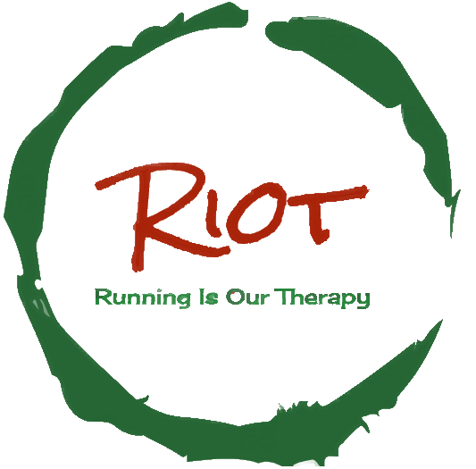

# R.I.O.T. (Running Is Our Therapy)
CSE-1211-Lab-Project



## Intro

This is a SDL2 game project for our 1st year 2nd semester Lab course.<br>
Our game is a basic running game consisting many speacial features. This game is made by-<br>
<table>
<b>
<tr><td>Ahaj Mahhin</td> <td>Roll- 01</td> <td>CSEDU-27th</td></tr>
<tr><td>Waki As-Sami</td> <td>Roll- 11</td> <td>CSEDU-27th</td></tr>
<tr><td>Zisan Mahmud</td> <td>Roll- 23</td> <td>CSEDU-27th</td></tr>
</b>
</table>
To play this game you have to install SDL2 libraries in your Linux operating system. Open and play, you will have fun.<br>

---
## Details

Running Is Our Therapy (R.I.O.T.) is an SDL-based survival game written in C/C++ language. Simple, clear, and easily customizable code made this game distinctive. This game has attractive features and a good user interface. Use of keyboard and mouse interaction has made the game more enjoyable. The game is not an infinite game, so we decided to make 2 levels of the game and completing all the levels with maximum collection of point will be awarded a "Champion Crown". Based on the concept of “Jurassic Survival” like avoiding obstacles, hunting for food, dodging the enemies etc. we add fully new theme that made the game distinctive.
---
## Language, Libraries, tools

- C/C++
- SDL2
- VS Code, gedit text editor
- LINUX Kernel based OS – UBUNTU 22.04 LTS
---
## Instructions

#### **Install SDL2 libraries**

```consle
$ sudo apt-get install libsdl2-dev
```
```consle
$ sudo apt-get install libsdl2-image-dev
```
```consle
$ sudo apt-get install libsdl2-ttf-dev
```
```consle
$ sudo apt-get install libsdl2-mixer-2.0-0
```
#### Build and run

```consle
make
```
---
## Video Link
```https://youtu.be/PfBPaJ7uiiw```
---
## Contact
```console
azmainfaiak45[at]gmail.com
```
```console
wakias9245[at]gmail.com
```
```console
zisanmahmud12002060[at]gamil.com
```
